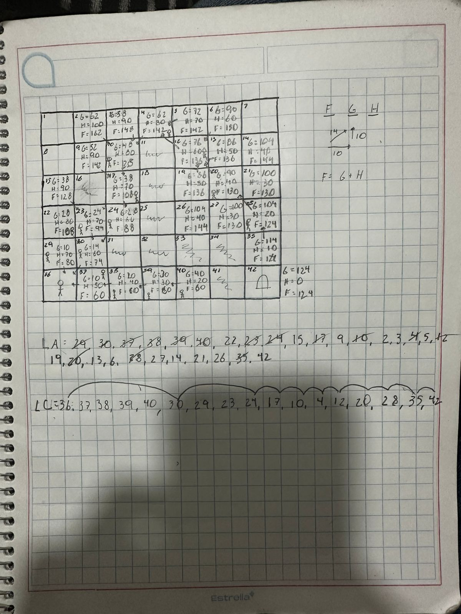

# Notas y Ejercicios de Inteligencia Artificial  
Este repositorio contiene material relacionado con las actividades y proyectos de la materia de Inteligencia Artificial, desarrollado por Pablo.  

## **Actividad - 05/02/2025**  
En esta actividad, se plantea un problema en el que se debe encontrar la mejor ruta desde un **punto inicial (A)** hasta un **destino (B)** dentro de una cuadrícula. Para lograrlo, se utilizarán principios de **teoría de grafos** y un sistema de cálculo basado en costos de desplazamiento.  

### **📌 Normas de Movimiento en la Cuadrícula**  

1. **Movimientos posibles:**  
   - **Vertical y Horizontal**: Cada desplazamiento en estas direcciones tiene un costo de **10 unidades**.  
   - **Diagonal**: Desplazarse en diagonal cuesta **14 unidades**.  

2. **Determinación del costo total de un camino:**  
   - **G (Costo acumulado)**: Representa la suma de los costos de todos los movimientos realizados desde el inicio hasta la posición actual.  
     - Ejemplo: Si el primer movimiento es hacia la derecha, G será **10**. Si después se mueve en diagonal, G se actualizará a **24** (10 + 14).  
   - **H (Costo heurístico)**: Es una estimación del costo necesario para llegar a la meta desde la posición actual.  
   - **F (Costo total estimado)**: Se obtiene sumando G y H, es decir:  
     ```math
     F = G + H
     ```  

---

### **📍 Pasos para encontrar la mejor ruta**  

1. **Definir el punto de inicio:**  
   - Se selecciona la celda inicial (A) y se asigna un costo acumulado **G = 0**.  

2. **Explorar las opciones de movimiento:**  
   - Se identifican todas las casillas adyacentes a la posición actual (Lista Abierta).  
   - Se calculan los valores de G, H y F para cada una de ellas.  

3. **Elegir la mejor opción:**  
   - Se selecciona la casilla con el **menor valor de F** como el siguiente paso a seguir.  
   - En caso de empate, se puede elegir según el orden en que fueron evaluadas u otro criterio establecido.  

4. **Repetir el proceso hasta alcanzar B:**  
   - Se repiten estos pasos hasta que el punto **B** sea alcanzado, registrando los valores de cada celda en la **Lista Cerrada** para evitar reevaluarlas innecesariamente.  

---

### **📎 Recursos Adicionales**  

-   
